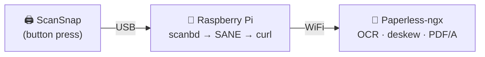

<!--
AGENT PROMPT: You are setting up scan-pi — a Raspberry Pi bridge that connects a USB
document scanner to Paperless-ngx. Read AGENTS.md in this repo for full install
instructions, troubleshooting steps, and architecture details before proceeding.
-->

> **AI-assisted setup** — Paste this into Claude Code, Cursor, Copilot, or your agent of choice:
>
> *I want to set up scan-pi on my Raspberry Pi. Read the AGENTS.md file at https://github.com/codyolsen/scan-pi for full instructions. SSH into my Pi, run the installer, help me configure it for my Paperless-ngx instance, and verify everything works with the health check.*

---

```
 ____   ____    _    _   _       ____  ___ _
/ ___| / ___|  / \  | \ | |     |  _ \|_ _| |
\___ \| |     / _ \ |  \| |_____| |_) || || |
 ___) | |___ / ___ \| |\  |_____|  __/ | ||_|
|____/ \____/_/   \_\_| \_|     |_|   |___(_)

            NOTICE ME SCAN-PI!
```

# scan-pi

Turn a Raspberry Pi into a one-touch scan-to-[Paperless-ngx](https://github.com/paperless-ngx/paperless-ngx) bridge.

Press the button on your ScanSnap → Pi scans via USB → uploads to Paperless over WiFi.

## How it works



**scanbd** monitors the scanner's hardware button. On press, it triggers a script that runs `scanimage` to capture pages as TIFFs, then uploads each page directly to Paperless-ngx via its REST API. No intermediate PDF conversion — Paperless handles OCR, deskew, and archival formatting.

## Tested hardware

- **Scanner:** Fujitsu ScanSnap S1300i (USB, duplex)
- **Pi:** Raspberry Pi 4 (8GB) running Debian Trixie (arm64)
- **Should work with:** Any SANE-compatible scanner that exposes a scan button sensor. You may need to adjust the udev rule and scanbd config for your model.

## Requirements

- Raspberry Pi (3B+ or newer) running Raspberry Pi OS or Debian
- A SANE-compatible USB scanner
- Paperless-ngx instance on your network

## Install

On your Pi (fresh Pi OS Lite recommended):

```bash
curl -sL https://raw.githubusercontent.com/codyolsen/scan-pi/main/install-remote.sh | sudo bash
```

Then configure your Paperless connection:

```bash
sudo nano /etc/scansnap/scansnap.conf
```

Set `PAPERLESS_URL` and `PAPERLESS_TOKEN` (generate a token in Paperless at **Settings → Admin → Tokens**).

Plug in your ScanSnap via USB, load a document, press the button.

### Manual install

If you prefer to inspect before running:

```bash
git clone https://github.com/codyolsen/scan-pi.git
cd scan-pi
# Read bootstrap.sh first, then:
sudo ./bootstrap.sh
```

### Deploy from dev machine

```bash
./install.sh youruser@your-pi-ip
```

### Health check

```bash
~/scansnap/health-check.sh
```

### Logs

```bash
tail -f /var/log/scansnap.log
```

## Configuration

All settings live in `/etc/scansnap/scansnap.conf`:

| Setting | Default | Description |
|---------|---------|-------------|
| `PAPERLESS_URL` | *(required)* | Your Paperless-ngx URL |
| `PAPERLESS_TOKEN` | *(required)* | API token for authentication |
| `SCANNER_DEVICE` | *(auto-discover)* | SANE device string, or leave blank |
| `RESOLUTION` | `300` | DPI (50-600) |
| `COLOR_MODE` | `Gray` | `Lineart`, `Gray`, or `Color` |
| `SOURCE` | `ADF Duplex` | `ADF Front`, `ADF Back`, or `ADF Duplex` |
| `RETRY_MAX` | `3` | Upload retry attempts |
| `RETRY_DELAY` | `30` | Seconds between retries |
| `CLEANUP_ON_SUCCESS` | `true` | Delete local scans after upload |

### Scan quality notes

- **300 DPI Gray** is optimal for OCR speed and accuracy. Tesseract (used by Paperless) recommends 300 DPI and converts to grayscale internally anyway.
- Paperless handles deskew, blank page removal (via unpaper), and PDF/A conversion on ingest. The Pi just sends raw TIFFs.

## Project structure

```
scan-pi/
├── bootstrap.sh                  # One-shot Pi setup (run with sudo)
├── install.sh                    # Deploy from dev machine via SSH
├── install-remote.sh             # One-liner installer (curl | sudo bash)
├── config/
│   ├── scansnap.conf.example     # Config template
│   ├── 99-scansnap.rules         # udev rule for scanner USB permissions
│   ├── scanbd-scan.script        # scanbd trigger script
│   └── scanner.d/
│       └── epjitsu.conf          # scanbd device config for S1300i
└── scripts/
    ├── scan-and-upload.sh        # Main scan workflow (called by scanbd)
    ├── upload-to-paperless.sh    # Paperless API upload helper
    └── health-check.sh           # Diagnose setup issues
```

## Troubleshooting

Run the health check to diagnose issues:

```bash
~/scansnap/health-check.sh
```

```
scan-pi health check
====================

Scanner:
  [OK]   USB device found: Bus 001 Device 112: ID 04c5:128d Fujitsu, Ltd ScanSnap S1300i
  [OK]   SANE finds the scanner
scanbd:
  [OK]   scanbd is running
  ...

  14 passed, 0 failed, 0 warnings
  Ready to scan!
```

**Scanner not detected:**
```bash
lsusb | grep -i fujitsu        # USB level
sane-find-scanner -q            # SANE level
```

**scanbd not running:**
```bash
sudo systemctl status scanbd
sudo journalctl -u scanbd -f
```

**USB errors / scanner disconnecting:**
Try a different USB cable or port. The Pi 4's USB 3.0 ports (blue) can be picky with some scanners — try the USB 2.0 ports (black).

**Button press not detected:**
Verify scanbd sees the scanner: `sudo systemctl restart scanbd && sudo journalctl -u scanbd -f`, then press the button.

## Supported ScanSnap models

The S1300i is tested. Other epjitsu-backend models (S1300, S1100, S300) should work with the same setup — they use the same SANE backend and need their own `.nal` firmware file.

For fujitsu-backend models (iX1600, iX1400, iX1300, fi-series), you'll need to modify the scanbd device config filter from `^epjitsu` to `^fujitsu` and no firmware file is needed.

## License

MIT
